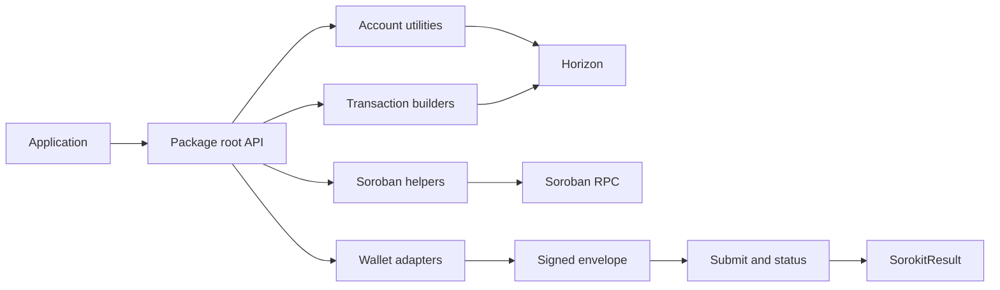

# Sorokit architecture

Sorokit is a framework-agnostic execution engine. The package root exposes stable public APIs, while implementation modules are grouped by responsibility so wallet, network, account, transaction, and Soroban concerns can evolve independently.

## Module boundaries

| Layer | Responsibility | Main entry points |
|---|---|---|
| `wallet/` | Detect wallets, connect, sign, merge signatures, and retain signing history. | `connect`, `signTransaction`, `mergeSignatures` |
| `network/` | Resolve network configuration, switch endpoints, and report health. | `resolveNetwork`, `NetworkSwitcher` |
| `account/` | Read account state, balances, activity, sponsorship, and trustline policy decisions. | `getAccount`, `getBalances`, `buildApprovedTrustlineTransaction` |
| `transaction/` | Build, validate, estimate, submit, monitor, analyze, reverse, and refund transactions. | `buildPaymentTransaction`, `submitTransaction`, `getTransactionStatus` |
| `soroban/` | Prepare, simulate, invoke, and recover Soroban contract calls. | `prepareContractCall`, `simulateContractSafe` |
| `shared/` | Result types, error classification, constants, server factories, logging, and metrics. | `SorokitResult`, `SorokitErrorCode` |

## Data flow



A typical transaction flows from a typed input to a validated unsigned XDR, then to a wallet signature, submission, and status monitoring. Builders do not own wallet state, and wallet adapters do not construct business-specific operations. This separation makes builders usable in server-side preparation and wallets replaceable in browser applications.

## Result and error model

Public functions return `SorokitResult<T>` instead of throwing. The success branch contains `data`; the error branch contains an error code, message, and optional cause. Callers should use `result.status` or the `isOk` and `isErr` guards. Error codes are stable control-flow signals; messages are for display and diagnostics.

```ts
const result = await buildPaymentTransaction(...);
if (result.status === "error") {
  if (result.error.code === SorokitErrorCode.TX_SEQUENCE_CONFLICT) {
    // Refresh the account and rebuild.
  } else {
    // Display or log the actionable failure.
  }
}
```

## Extension guidance

New workflows should compose existing builders and validators rather than create a second transaction-construction path. Policy modules should decide whether an operation is permitted before construction. Analysis modules should remain deterministic and side-effect free whenever possible. Network-dependent modules should use the shared server factory and classify failures through the shared error helpers.

## Migration from direct Stellar SDK usage

Applications that currently instantiate `TransactionBuilder` directly can migrate incrementally: keep their existing wallet adapter, replace construction with a Sorokit builder, branch on `SorokitResult`, and pass the returned XDR to the same signing and submission flow. For contract calls, move simulation before signing and use the returned error code to decide whether to retry, refresh sequence data, or ask the user for an updated input.
